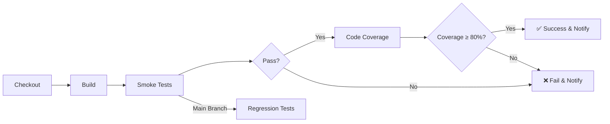

# Quality Gateway CI/CD Project

A comprehensive demonstration of CI/CD pipeline with automated quality gates, featuring a real e-commerce application with tagged test suites, code coverage enforcement, and automated notifications.

## 🎯 Project Overview

This project showcases enterprise-grade CI/CD practices including:
- **Real Application**: Functional e-commerce system with Product, Cart, and Order management
- **Tagged Test Suites**: Smoke and regression tests for different pipeline stages
- **Quality Gates**: Automated enforcement of quality standards
- **Code Coverage**: Minimum 80% coverage requirement
- **CI/CD Pipeline**: GitHub Actions with multi-stage workflow
- **Notifications**: Slack integration for build status alerts

## 🏗️ Architecture

### Application Components

```
E-commerce Application
├── Models
│   ├── Product (catalog management)
│   ├── ShoppingCart (cart operations)
│   ├── CartItem (line items)
│   └── Order (order processing)
└── Services
    ├── ProductService (product CRUD)
    └── OrderService (order lifecycle)
```

### Test Strategy

| Tag | Purpose | When to Run | Test Count |
|-----|---------|-------------|------------|
| `@smoke` | Critical path validation | Every PR, every commit | ~12 tests |
| `@regression` | Full functionality coverage | Main branch, nightly | ~40+ tests |

## 🚀 Quick Start

### Prerequisites
- Java 17+
- Maven 3.8+
- Git

### Local Setup

1. **Clone the repository**
```bash
git clone <repository-url>
cd QualityGatewayCI_CD
```

2. **Build the project**
```bash
mvn clean compile
```

3. **Run smoke tests** (fast feedback)
```bash
./scripts/run-smoke-tests.sh
# or
mvn test -DtestGroups=smoke
```

4. **Run regression tests** (full suite)
```bash
./scripts/run-regression-tests.sh
# or
mvn test -DtestGroups=regression
```

5. **Check code coverage** (with quality gate)
```bash
./scripts/check-coverage.sh
# or
mvn clean verify
```

## 📊 Quality Gates

### Gate 1: Critical Test Failure ❌
**Purpose**: Ensure critical functionality works before proceeding

**Implementation**:
- Runs smoke tests tagged with `@smoke`
- Pipeline fails immediately if any smoke test fails
- Prevents broken code from reaching main branch

**Example**:
```java
@Test(groups = {"smoke", "regression"})
public void testAddItemToCart_Success() {
    cart.addItem(product, 1);
    assertEquals(cart.getItemCount(), 1);
}
```

### Gate 2: Code Coverage Threshold 📈
**Purpose**: Maintain minimum 80% code coverage

**Implementation**:
- JaCoCo generates coverage report
- Script extracts coverage percentage
- Pipeline fails if coverage < 80%

**How it works**:
```bash
# Extract coverage from JaCoCo CSV
COVERAGE=$(awk -F"," '{ instructions += $4 + $5; covered += $5 } 
           END { print int(100*covered/instructions) }' 
           target/site/jacoco/jacoco.csv)

# Check threshold
if [ "$COVERAGE" -lt "80" ]; then
    exit 1  # Fail the build
fi
```

## 🔄 CI/CD Pipeline

### Pipeline Stages



### Workflow Jobs

#### 1. **Smoke Tests** (Runs on every PR/push)
- Checkout code
- Setup Java 17
- Build application
- Run smoke tests
- **Quality Gate 1**: Fail if any smoke test fails

#### 2. **Regression Tests** (Runs on main branch only)
- Full test suite execution
- Generates detailed test reports
- Uploads artifacts for review

#### 3. **Code Coverage** (Runs after smoke tests pass)
- Execute tests with JaCoCo agent
- Generate coverage report
- **Quality Gate 2**: Fail if coverage < 80%
- Comment coverage on PR
- Upload coverage artifacts

#### 4. **Notifications** (Always runs)
- Determine overall status
- Send Slack notification
- Create job summary

### Trigger Conditions

| Event | Smoke Tests | Regression | Coverage |
|-------|-------------|------------|----------|
| Pull Request | ✅ | ❌ | ✅ |
| Push to main | ✅ | ✅ | ✅ |
| Push to develop | ✅ | ❌ | ✅ |

## 📈 Test Reports

### Viewing Reports Locally

1. **Test Results**
```bash
mvn test
# View: target/surefire-reports/index.html
```

2. **Coverage Report**
```bash
mvn verify
# View: target/site/jacoco/index.html
```

### CI Artifacts

Reports are automatically uploaded as GitHub Actions artifacts:
- `smoke-test-reports/` - Smoke test results
- `regression-test-reports/` - Full regression results
- `coverage-reports/` - JaCoCo coverage HTML reports

**Access**: Go to Actions → Select workflow run → Artifacts section

## 🔔 Notifications

### Slack Integration

#### Setup
1. Create Slack webhook URL
2. Add to GitHub Secrets: `SLACK_WEBHOOK_URL`
3. Pipeline automatically sends notifications

#### Notification Types

**Failure Notification**:
```
❌ Build Failed - Quality Gate
Repository: your-org/QualityGatewayCI_CD
Branch: main
Triggered by: developer-name
Reason: Code coverage below threshold
[View Build Button]
```

**Success Notification**:
```
✅ Build Successful - All Quality Gates Passed
Repository: your-org/QualityGatewayCI_CD
Branch: main
Triggered by: developer-name
```

### Email Notifications (Optional)

GitHub Actions automatically sends email to:
- Commit author (on failure)
- Workflow initiator

## 🧪 Test Examples

### Smoke Test (Critical Path)
```java
@Test(groups = {"smoke", "regression"}, priority = 1)
public void testCreateOrder_Success() {
    Product product = productService.getProductById("P001");
    cart.addItem(product, 1);
    Order order = orderService.createOrder(cart, "123 Main St");
    
    assertNotNull(order);
    assertEquals(order.getStatus(), Order.OrderStatus.PENDING);
}
```

### Regression Test (Edge Case)
```java
@Test(groups = {"regression"})
public void testCreateOrder_InsufficientStock() {
    Product product = productService.getProductById("P001");
    productService.updateStock("P001", 1);
    cart.addItem(product, 1);
    
    ShoppingCart cart2 = new ShoppingCart("user456");
    cart2.addItem(product, 1);
    
    assertThrows(IllegalStateException.class, () -> {
        orderService.createOrder(cart2, "456 Oak Ave");
    });
}
```

## 📁 Project Structure

```
QualityGatewayCI_CD/
├── .github/
│   └── workflows/
│       └── ci-pipeline.yml          # Main CI/CD pipeline
├── src/
│   ├── main/java/com/ecommerce/
│   │   ├── model/                   # Domain models
│   │   │   ├── Product.java
│   │   │   ├── ShoppingCart.java
│   │   │   ├── CartItem.java
│   │   │   └── Order.java
│   │   └── service/                 # Business logic
│   │       ├── ProductService.java
│   │       └── OrderService.java
│   └── test/
│       ├── java/com/ecommerce/tests/
│       │   ├── ProductServiceTest.java    # @smoke + @regression
│       │   ├── ShoppingCartTest.java      # @smoke + @regression
│       │   └── OrderServiceTest.java      # @smoke + @regression
│       └── resources/
│           ├── testng.xml                 # Dynamic test suite
│           ├── testng-smoke.xml           # Smoke tests only
│           └── testng-regression.xml      # Regression tests only
├── scripts/
│   ├── check-coverage.sh            # Local coverage validation
│   ├── run-smoke-tests.sh           # Run smoke tests locally
│   └── run-regression-tests.sh      # Run regression tests locally
├── pom.xml                          # Maven configuration
└── README.md
```

## 🎓 Key Learnings & Interview Points

### 1. **Why Quality Gates Matter**
- Prevents broken code from reaching production
- Enforces quality standards automatically
- Provides fast feedback to developers
- Reduces manual review overhead

### 2. **Test Tagging Strategy**
- `@smoke`: 10-15% of tests, covers critical paths, runs in <2 minutes
- `@regression`: 100% of tests, comprehensive coverage, runs in <10 minutes
- Enables different testing strategies per environment

### 3. **Coverage as a Quality Metric**
- 80% is industry standard for good coverage
- Line coverage + branch coverage
- Not just quantity - quality matters too
- Use coverage to find untested code paths

### 4. **CI/CD Best Practices**
- Fail fast with smoke tests
- Parallel job execution where possible
- Artifact retention for debugging
- Clear failure messages
- Automated notifications

## 🔧 Configuration

### Adjusting Coverage Threshold

**In pom.xml**:
```xml
<properties>
    <coverage.threshold>0.80</coverage.threshold>  <!-- 80% -->
</properties>
```

**In GitHub Actions**:
```yaml
env:
  COVERAGE_THRESHOLD: 80
```

**In local script**:
```bash
THRESHOLD=80  # scripts/check-coverage.sh
```

### Adding New Test Groups

1. Tag your test:
```java
@Test(groups = {"smoke", "api", "regression"})
public void testApiEndpoint() { }
```

2. Create TestNG suite:
```xml
<groups>
    <run>
        <include name="api" />
    </run>
</groups>
```

3. Add to pipeline:
```yaml
- name: Run API Tests
  run: mvn test -DtestGroups=api
```

## 📞 Support & Contribution

### Running into Issues?

1. **Tests failing locally?**
   - Check Java version: `java -version` (should be 17+)
   - Clean build: `mvn clean install`
   - Check logs: `target/surefire-reports/`

2. **Coverage not meeting threshold?**
   - View report: `target/site/jacoco/index.html`
   - Focus on service layer (business logic)
   - Add tests for edge cases

3. **Pipeline failing?**
   - Check Actions tab for detailed logs
   - Verify secrets are configured (SLACK_WEBHOOK_URL)
   - Ensure branch protection rules allow workflow

## 📜 License

This project is for educational and demonstration purposes.

---

**Built with ❤️ to demonstrate Quality Gateway CI/CD practices**

